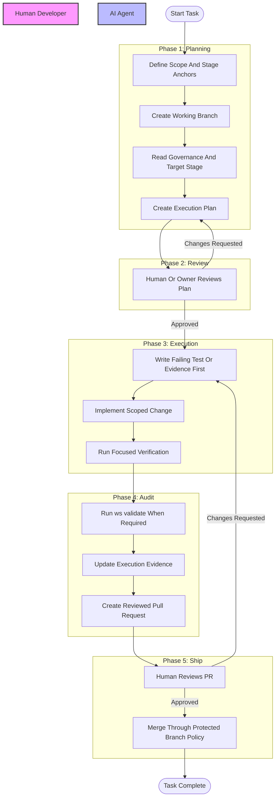

# Visual SDLC Workflow

## Purpose

This document defines the stable human-agent collaboration flow and baton-passing model for governed SDLC work.

## Overview

This document visualizes the human-agent collaboration loop and the review points where responsibility passes between humans and agents.

It is a workflow reference, not active task memory and not a policy change history. Use `docs/00.agent-governance/memory/progress.md` for current progress and handoff state, `docs/00.agent-governance/memory/methodology.md` for active methodology state, and `docs/00.agent-governance/policy-change-log.md` for versioned governance changes.

video-analysis does not use `00_System/sdlc-workflow.md` as a governance surface. If a derived or Vault-style workspace has a `00_System/sdlc-workflow.md`, it is downstream workspace documentation and must not override this Stage 00 workflow reference.

`00.agent-governance/sdlc-workflow.md` without a `docs/` prefix is permitted only as docs-relative shorthand for `docs/00.agent-governance/sdlc-workflow.md`. Do not create a root-level `00.agent-governance/` directory or use it as a separate workflow authority.

## Scope

### In Scope

- Stable collaboration phases between humans and agents.
- Baton-passing points and required handoff artifacts.
- Relationship between flow steps and canonical docs paths.

### Out of Scope

- Active task progress, blockers, and durable run notes; use `docs/00.agent-governance/memory/progress.md`.
- Active methodology selection; use `docs/00.agent-governance/memory/methodology.md`.
- Versioned policy, SDLC protocol, runtime contract, or validator changes; use `docs/00.agent-governance/policy-change-log.md`.
- Transient coordination, generated diagnostics, generated intelligence, or scratch output; use `_workspace/**` only as non-authoritative runtime output.
- Root-level duplicate workflow surfaces such as `00.agent-governance/sdlc-workflow.md`; expand shorthand references to `docs/00.agent-governance/sdlc-workflow.md`.
- Derived-workspace control-plane files such as `00_System/sdlc-workflow.md`; they are outside this template's canonical docs contract.

## Authority Boundaries

| Surface | Owns | Does Not Own |
| :--- | :--- | :--- |
| `sdlc-workflow.md` | Stable collaboration flow, baton handoff points, and review checkpoints. | Active progress, methodology state, policy history, or final execution evidence. |
| `memory/progress.md` | Current task state, phase progress, handoff state, blockers, and durable run notes. | General SDLC flow or versioned policy changes. |
| `memory/methodology.md` | Active methodology choice and run-state memory. | Methodology taxonomy, hard stops, or visual workflow. |
| `policy-change-log.md` | Versioned governance, SDLC protocol, runtime contract, and validator changes. | Current progress, methodology state, or visual flow description. |
| `00.agent-governance/sdlc-workflow.md` | Docs-relative shorthand only when clearly referring to `docs/00.agent-governance/sdlc-workflow.md`. | Root-level workflow, policy, progress, methodology, or memory records. |
| `00_System/sdlc-workflow.md` | No authority in video-analysis. | video-analysis workflow, policy, progress, methodology, or memory records. |
| `_workspace/**` | Transient runtime coordination or generated output. | Any authoritative workflow, progress, policy, methodology, or memory record. |

## Workflow Diagram

## Baton Passing Points

| Point | Handover | Key Deliverable |
| :--- | :--- | :--- |
| Scope | Human -> Agent | Task request, target stage, and constraints |
| Plan Review | Agent -> Human | `docs/04.execution/plans/YYYY-MM-DD-<slug>.md` |
| Execution | Human -> Agent | Approval to implement the scoped plan |
| Audit | Agent -> Human | Validation evidence and `docs/04.execution/tasks/YYYY-MM-DD-<slug>.md` |
| PR Review | Human -> Agent | Feedback or approval |

## AI Execution Checklist

- [ ] Identify the current baton holder.
- [ ] Confirm execution plan coverage before implementation.
- [ ] Record implementation or validation evidence in `docs/04.execution/tasks/`.
- [ ] Update `docs/00.agent-governance/memory/progress.md` at handoff and closure.
- [ ] Run the required validation gate before PR or final handoff.
- [ ] Stop if execution begins without the required plan approval.

## Related Documents

- [Memory README](./memory/README.md)
- [Session Progress](./memory/progress.md)
- [Methodology State](./memory/methodology.md)
- [Policy Change Log](./policy-change-log.md)
- [Documentation Protocol](./rules/documentation-protocol.md)
- [LLM-WIKI](../LLM-WIKI.md)
