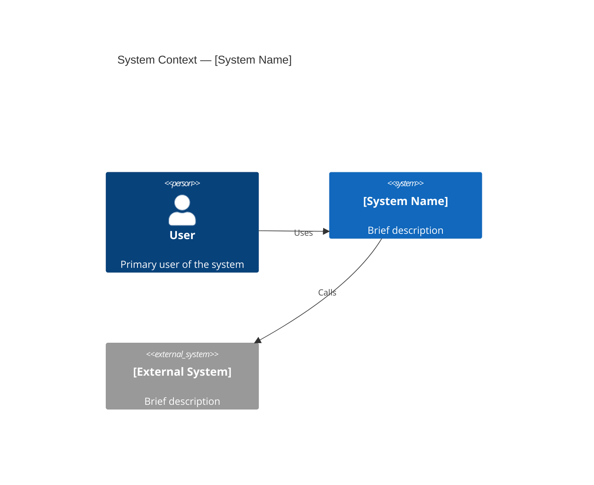

# Architecture Reference Document (ARD)

<!-- Target: docs/02.architecture/requirements/####-<slug>.md -->

## Usage Guidance

- **When to use**: To define system boundaries, responsibilities, and quality attributes.
- **Mandatory sections**: Overview, C4 Diagrams, DDD Strategic Design.
- **Naming rule**: `####-<slug>.md` (sequenced).
- **Hard Stops**: STOP if C4 Context diagram is missing. STOP if DDD triggers are not evaluated.
- **Generation rule**: For derived-project seeds, keep `status: draft`, replace bracketed prompts with project facts or `TODO:`, and do not copy Project-Template maintenance architecture as active project architecture.
- **Lifecycle reference**: Apply `docs/00.agent-governance/rules/template-document-lifecycle.md` before reusing inherited documents.

## Purpose

The ARD acts as the architectural blueprint for a system or domain. It defines how components interact and what quality attributes (performance, security, etc.) are prioritized.

---

## [System or Domain Name] Architecture Reference Document

## Overview (KR)

이 문서는 [시스템 또는 도메인명]의 참조 아키텍처와 품질 속성을 정의한다. 시스템 경계, 책임, 데이터 흐름, 운영 관점을 정리하는 기준 문서다.

## Summary

[What this system owns and why.]

## Boundaries & Non-goals

- **Owns**:
- **Consumes**:
- **Does Not Own**:
- **Non-goals**:

## Quality Attributes

- **Performance**:
- **Security**:
- **Reliability**:
- **Scalability**:
- **Observability**:
- **Operability**:

## System Overview & Context

[High-level architecture and context.]

### C4 Context & Container Diagrams (Mandatory)

> **AI Hard Stop**: C4 Context diagram is mandatory. C4 Container diagram is mandatory for multi-component systems.

## Data Architecture

- **Key Entities / Flows**:
- **Storage Strategy**:
- **Data Boundaries**:

## Infrastructure & Deployment

- **Runtime / Platform**:
- **Deployment Model**:
- **Operational Evidence**:

## DDD Strategic Design

> **Mandatory section.** Every ARD must document the domain classification and complete at minimum the condensed Bounded Context Overlay and Ubiquitous Language Overlay below — even for single-context systems. Mark as `N/A` only with explicit rationale.

### Domain Strategy

- **Domain Classification**: `Core Domain / Supporting Domain / Generic Subdomain` — _choose one and justify_
- **Context Map Pattern**: `Shared Kernel / Customer-Supplier / Conformist / ACL / OHS / Not Applicable` — _choose one and justify_
- **DDD Trigger Evaluation Result**: `Condensed overlay sufficient / Expanded DDD docs required` — _fill after evaluating triggers below_

### Bounded Context Overlay (Condensed — Required Minimum)

> Fill this inline overlay for simple or single-context systems. If triggers below fire, also create expanded companion documents.

- **Context Name**: [BoundedContextName]
- **Responsibilities**: [What this context owns — business capabilities, not technical layers]
- **Aggregates**: [Core aggregate roots — e.g., Order, Customer, Payment]
- **Key Invariants**: [Business rules always enforced by this context — e.g., "Order total must be positive"]
- **Integration Contracts**: [How this context communicates with others — e.g., `ContextA.Order → PurchaseRequest via ACL`; or "None — isolated context"]

### Ubiquitous Language Overlay (Condensed — Required Minimum)

> Define at least 3–5 terms that appear in code and documents. Add rows as needed.

| Term   | Korean   | Definition                                         | Notes                                      |
| :----- | :------- | :------------------------------------------------- | :----------------------------------------- |
| [Term] | [한국어] | [Precise domain definition, not a technical gloss] | [Context-specific usage or disambiguation] |
| [Term] | [한국어] | [Definition]                                       | [Notes]                                    |
| [Term] | [한국어] | [Definition]                                       | [Notes]                                    |

---

### DDD Trigger Condition (Evaluate Before Closing ARD)

Evaluate each trigger. Check all that apply, then set **DDD Trigger Evaluation Result** above.

- [ ] Two or more independent business domains collaborate in this system.
- [ ] The same term has different meanings across domains or teams.
- [ ] Different teams own different parts of the domain model.
- [ ] Event Sourcing, CQRS, saga, or process-manager patterns are required.
- [ ] Integration requires an Anti-Corruption Layer (ACL), Open Host Service (OHS), or Published Language.

**If any trigger is checked**, create expanded companion documents before Stage 04 approval:

- `docs/02.architecture/requirements/####-<bounded-context-name>.md` using `expanded/bounded-context.template.md`
- `docs/02.architecture/requirements/####-ubiquitous-language-<domain>.md` using `expanded/ubiquitous-language.template.md`

**If no triggers are checked**, the condensed overlays above are sufficient. State "No DDD expansion needed — single-context system" in **DDD Trigger Evaluation Result**.

---

### Expanded DDD Documentation (If Triggered)

Link companion documents here when created:

- Bounded Context: `[./####-<bounded-context-name>.md]`
- Ubiquitous Language: `[./####-ubiquitous-language-<domain>.md]`
- Domain Model: `[../../03.specs/<feature-id>/domain-model.md]` (Stage 04 tactical detail)

## Target-Relative Link Guidance

Keep placeholder paths as code spans until a generated document links to an existing file.

| Target Location                                    | Governance Example                                       | Common Upstream/Downstream                                                                                               |
| -------------------------------------------------- | -------------------------------------------------------- | ------------------------------------------------------------------------------------------------------------------------ |
| `docs/02.architecture/requirements/####-<slug>.md` | `[../../00.agent-governance/rules/stage-gate-matrix.md]` | `[../../01.requirements/YYYY-MM-DD-<slug>.md]`, `[../decisions/####-<slug>.md]`, `[../../03.specs/<feature-id>/spec.md]` |

## AI Execution Checklist

### Entry Gate

- [ ] Confirm the upstream PRD exists or explicitly document why this ARD is infrastructure/governance-only.
- [ ] Evaluate `## DDD Trigger Condition`.
- [ ] Scan `docs/02.architecture/requirements/` for overlapping ARD or bounded-context documents.

### Exit Gate

- [ ] Define boundaries, non-goals, quality attributes, and context diagrams.
- [ ] Link any DDD companion documents or state why they are not needed.
- [ ] Update `docs/02.architecture/requirements/README.md`.
- [ ] Run `stage-gate-review` before freezing the ARD for Stage 04.

### Hard Stop Conditions

- **STOP** if no approved PRD exists and this ARD is not explicitly scoped to infrastructure-only or governance purposes.
- **STOP** if system boundaries conflict with an existing ARD and no ADR resolves the overlap.
- **STOP** if DDD trigger conditions were evaluated but not documented in `## DDD Trigger Condition`.
- **STOP** if the mandatory C4 Context diagram is missing.
- **STOP** before Stage 04 (frontend) if `DESIGN.md` `version` or `name` is still `<string>`.

### Downstream Trigger

- [ ] Create or update ADRs when architecture choices are significant.
- [ ] Create or update Stage 04 Spec and DDD companion documents when implementation design is needed.

### Evidence Rule

- [ ] Boundaries, quality attributes, and domain choices MUST cite specific PRD constraints, architecture review notes, or source code inspections.

## AI Agent Architecture Requirements (If Applicable)

- **Model/Provider Strategy**:
- **Tooling Boundary**:
- **Memory & Context Strategy**:
- **Guardrail Boundary**:
- **Latency / Cost Budget**:

## Related ADRs

| ADR                                    | Title            | Status   | Date       |
| :------------------------------------- | :--------------- | :------- | :--------- |
| `[../decisions/####-<short-title>.md]` | [Decision title] | Accepted | YYYY-MM-DD |

## Related Documents

- **PRD**: `[../../01.requirements/YYYY-MM-DD-<feature-or-system>.md]`
- **Spec**: `[../../03.specs/<feature-id>/spec.md]`
- **Plan**: `[../../04.execution/plans/YYYY-MM-DD-<feature>.md]`
- **ADR**: `[../decisions/####-<short-title>.md]`
