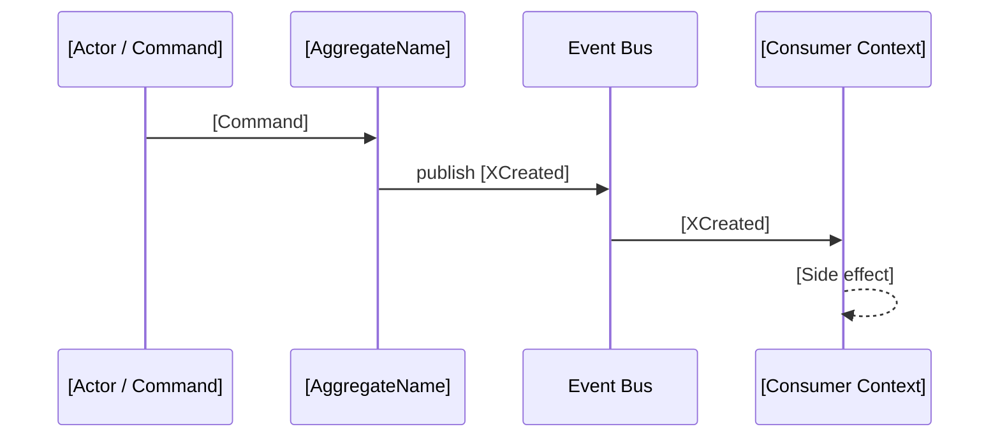

# Domain Event Catalog

<!-- Target: docs/03.specs/<feature-id>/domain-events.md -->

## Usage Guidance

- **When to use**: When a feature generates or consumes domain events that cross context boundaries.
- **Mandatory sections**: Overview, Event Catalog, Event Schemas, Consumer Contracts.
- **Naming rule**: `domain-events.md`.
- **Hard Stops**: STOP if producer or consumer ownership is undefined. STOP if event schemas lack versioning.

## Purpose

The Domain Event Catalog defines the asynchronous contracts between contexts. It ensures that events (facts) are clearly defined, versioned, and that consumers can rely on specific data payloads.

---

## Overview (KR)

이 문서는 [기능명]의 도메인 이벤트 카탈로그다. 이벤트 정의, 스키마, 소비자 계약을 정리한다.

## Bounded Context Reference

- **Context**: [BoundedContextName]
- **Domain Model**: `[./domain-model.md]`

## Event Catalog

| Event Name | Source Aggregate | Trigger | Consumers | Schema Version |
| :--- | :--- | :--- | :--- | :--- |
| [XCreated] | [AggregateName] | [CreateX command succeeds] | [ServiceA, ServiceB] | v1 |

## Event Schemas

### [XCreated]

```yaml
event: XCreated
version: v1
source: [AggregateName]
trigger: '[Business trigger description]'
schema:
  eventId: uuid
  occurredAt: ISO8601
  aggregateId: uuid
  # [domain fields]
breaking-change-policy: 'new required fields = breaking; new optional fields = non-breaking'
```

## Event Flow Diagram



## Consumer Contracts

| Consumer | Event | Guarantee Required | ACL Needed |
| :--- | :--- | :--- | :--- |
| [ServiceA] | [XCreated] | [Field X is always present] | Yes / No |

## Event Sourcing Notes (If Applicable)

- **Event Store**: [e.g., EventStoreDB, PostgreSQL append-only table]
- **Snapshot policy**: [e.g., every 50 events]
- **Replay guarantee**: [e.g., events are immutable after publish]

## AI Execution Checklist

- [ ] **Entry Gate**: ARD or domain model identifies business events crossing boundaries.
- [ ] **Exit Gate**: Events, producers, consumers, payloads, and reliability rules are completely defined.

### Hard Stop Conditions

- **STOP** if no ARD or domain model has confirmed business events crossing context boundaries. STOP if event producer and consumer ownership are undefined.
- [ ] **Downstream Trigger**: Update Spec contracts, tests, tasks, operations, and runbooks.
- [ ] **Evidence Rule**: Integration tests or event contract checks are explicitly linked.

## Related Documents

- **Domain Model**: `[./domain-model.md]`
- **Spec**: `[./spec.md]`
- **Bounded Context**: `[../../02.architecture/requirements/####-<bounded-context-name>.md]`
