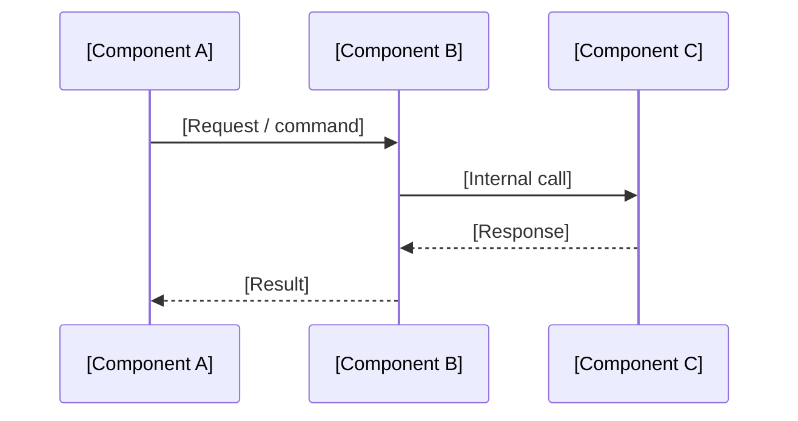
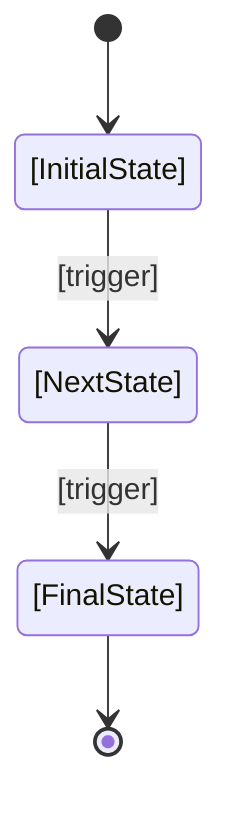

# Technical Specification (Spec)

<!-- Target: docs/03.specs/<feature-id>/spec.md -->

## Usage Guidance

- **When to use**: Before implementation to define technical contracts and design.
- **Mandatory sections**: Overview, SDD (Sequence Diagrams), TDD Readiness.
- **Naming rule**: `spec.md` (within a feature-specific directory).
- **Hard Stops**: STOP if a flow has 3+ components but no sequence diagram. STOP if TDD mapping is missing.
- **Generation rule**: For derived-project seeds, keep `status: draft`, replace bracketed prompts with project facts or `TODO:`, and do not copy Project-Template maintenance specs as active feature specs.
- **Lifecycle reference**: Apply `docs/00.agent-governance/rules/template-document-lifecycle.md` before reusing inherited documents.

## Purpose

The Spec provides the technical blueprint for a feature. It defines component interactions, data structures, and the testing strategy required before coding begins.

---

## Overview (KR)

이 문서는 [기능명]의 기술 설계와 구현 계약을 정의하는 명세서다. PRD 요구를 기술적으로 구체화하고, 구현과 검증의 직접 기준이 된다.

## Strategic Boundaries & Non-goals

[What this spec owns, and what it does not.]

## Related Inputs

- **PRD**: `[../../01.requirements/YYYY-MM-DD-<feature-or-system>.md]`
- **ARD**: `[../../02.architecture/requirements/####-<system-or-domain-name>.md]`
- **Related ADRs**: `[../../02.architecture/decisions/####-<short-title>.md]`

## Contracts

- **Config Contract**:
- **Data / Interface Contract**:
- **Governance Contract**:

## Core Design

- **Component Boundary**:
- **Key Dependencies**:
- **Tech Stack**:

## Data Modeling & Domain Strategy (DDD)

### Domain Tactical Overlay (Condensed)

> Use this inline overlay for simple tactical designs. For complex features, use separate companion documents.

#### Aggregates & Invariants

| Aggregate Root  | Invariants                            | Commands           | Events Raised        |
| :-------------- | :------------------------------------ | :----------------- | :------------------- |
| [AggregateName] | [Business rule that must always hold] | [CreateX, UpdateX] | [XCreated, XUpdated] |

#### Domain Events Catalog

| Event Name | Trigger                    | Consumers            | Schema Version |
| :--------- | :------------------------- | :------------------- | :------------- |
| [XCreated] | [CreateX command succeeds] | [ServiceA, ServiceB] | v1             |

#### Repository Contracts

| Repository                | Methods                      | Storage Hint          |
| :------------------------ | :--------------------------- | :-------------------- |
| [AggregateName]Repository | `findById`, `save`, `delete` | [e.g., Table `users`] |

---

### Expanded DDD Documentation (If Needed)

If the domain logic is complex, use separate files:

- Domain Model: `[./domain-model.md]`
- Domain Events: `[./domain-events.md]`

## DDD Mandatory Checklist

- [ ] Identify if this feature involves complex business logic. If so, provide inline DDD details or link companion documents.
- [ ] Ensure all Aggregate Invariants are reflected in the `## Verification` plan.

## Interfaces & Data Structures

### Core Interfaces

```typescript
interface ExampleContract {
  id: string;
  name: string;
}
```

## Component Interaction & Sequence (SDD)

> **SDD Scope Rule**: A sequence diagram is **mandatory** when a flow involves 3 or more distinct components (services, processes, external systems, or AI agents). This is not discretionary. Count components per flow and document each one.

## SDD Mandatory Checklist

- [ ] Count participating components for each core flow.
- [ ] Add a Mermaid `sequenceDiagram` for any flow with 3+ components.
- [ ] Add a Mermaid `stateDiagram-v2` when state transitions affect correctness, retries, escalation, or rollback.
- [ ] Confirm diagrams match the prose and contracts in this Spec.
- [ ] If C4 context/container coverage is absent from the ARD, add or link the missing system-boundary diagram.

### Key Flow: [Flow Name]



### State Transitions (If Applicable)



## API Contract (If Applicable)

Contract-first 원칙: 이 기능이 외부 API를 제공하는 경우, 상세 API 계약은 별도 API Spec 문서에서 정의한다.

- **API Spec**: `[./api-spec.md]`
- **Policy**: API Spec은 별도 최상위 API 문서 트리가 아니라 현재 feature 디렉터리 아래에 둔다.
- **Machine-readable Contract**:
  - `./contracts/openapi.yaml`
  - `./contracts/service.proto`
  - `./contracts/schema.graphql`

## Frontend Design Contract (If Applicable)

> Include this section when this spec involves frontend, mobile, or any UI implementation.

- **DESIGN.md**: `[../../../DESIGN.md]` — read before implementing any UI component
- **Design system status**: `[confirmed ready | pending — version/name not yet defined]`
- **Token scope**: [List which token groups this feature uses — e.g., "colors.primary, typography.body-*, components.button-*"]
- **New components introduced**: [List any new components that must be added to `DESIGN.md` after implementation]
- **Token deviations**: [None | link to ADR if any design token deviation is required]

> **AI Hard Stop**: If `DESIGN.md` `version` is `<string>` or `name` is `<string>`, do not start frontend implementation. Halt and request design system definition.

## TDD Readiness (Mandatory Before `docs/04.execution/plans/`)

> **AI Hard Stop**: This section is NOT optional. Every `impl` task must have a test mapping or an approved exemption before this spec can be marked `ready`.

### Acceptance Criteria → Test Case Mapping

| AC ID  | Acceptance Criterion (from PRD) | Test Type                | Test Location                    | TDD Exemption |
| :----- | :------------------------------ | :----------------------- | :------------------------------- | :------------ |
| AC-001 | [Given/When/Then from PRD]      | unit / integration / e2e | `tests/<feature>/test_<name>.py` | —             |
| AC-002 | [Given/When/Then from PRD]      | unit / integration / e2e | `tests/<feature>/test_<name>.py` | —             |

### TDD Strategy Decision

- **Test framework**: [pytest / jest / vitest / other]
- **Test file location**: `tests/<feature>/`
- **Tests document**: `[./tests.md]` — create using `tests.template.md` before `docs/04.execution/plans/`
- **TDD Exemptions** (if any): `external-integration` / `ui-exploratory` / `infra-setup` / `legacy-modification` — _each must include rationale_

> **AI Hard Stop**: STOP if any `impl` behavior lacks a corresponding test mapping row or a documented exemption. This section must be filled before the spec is marked `ready`.

## Agent Role & IO Contract (If Applicable)

- **Agent Role**:
- **Inputs**:
- **Outputs**:
- **Success Definition**:

## Tools & Tool Contract (If Applicable)

- **Tool List**:
- **Permission Boundary**:
- **Failure Handling**:

## Prompt / Policy Contract (If Applicable)

- **System / Instruction Contract**:
- **Policy Constraints**:
- **Versioning Rule**:

## Memory & Context Strategy (If Applicable)

- **Short-term Context**:
- **Long-term Memory**:
- **Retrieval Boundary**:

## Guardrails (If Applicable)

- **Input Guardrails**:
- **Output Guardrails**:
- **Blocked Conditions**:
- **Escalation Rule**:

## Evaluation (If Applicable)

- **Eval Types**:
- **Metrics**:
- **Datasets / Fixtures**:
- **How to Run**:

## Edge Cases & Error Handling

- **Error 1**:
- **Error 2**:

## Failure Modes & Fallback / Human Escalation

- **Failure Mode**:
- **Fallback**:
- **Human Escalation**:

## Verification

List the required commands, manual checks, or evidence capture steps.

```bash
[command 1]
[command 2]
pytest tests/[feature]_test.py
python evals/run_[feature]_eval.py
```

## Verification Strategy

| ID          | Level       | Command / Check                              | Pass Criteria     |
| ----------- | ----------- | -------------------------------------------- | ----------------- |
| VAL-SPC-001 | Unit        | `pytest tests/<feat>/`                       | All tests green   |
| VAL-SPC-002 | Integration | `pytest tests/integration`                   | No regressions    |
| VAL-SPC-003 | Lint        | `pre-commit run --all`                       | Zero violations   |
| VAL-SPC-004 | Ref         | `scripts/validation/validate-cross-links.sh` | Zero broken links |

## Target-Relative Link Guidance

Keep placeholder paths as code spans until a generated document links to an existing file.

| Target Location                      | Governance Example                                       | Common Upstream/Downstream                                                                                        |
| ------------------------------------ | -------------------------------------------------------- | ----------------------------------------------------------------------------------------------------------------- |
| `docs/03.specs/<feature-id>/spec.md` | `[../../00.agent-governance/rules/stage-gate-matrix.md]` | `[../../01.requirements/YYYY-MM-DD-<slug>.md]`, `[./tests.md]`, `[../../04.execution/plans/YYYY-MM-DD-<slug>.md]` |

## AI Execution Checklist

### Entry Gate

- [ ] Confirm upstream PRD and ARD are linked or explicitly absent.
- [ ] Confirm relevant ADRs are linked when decisions already exist.
- [ ] Read companion templates needed for this feature (`api-spec`, `data-model`, `tests`, `domain-model`, `domain-events`).
- [ ] Evaluate DDD mandatory section: confirm domain classification, bounded context overlay, and ubiquitous language overlay are populated in ARD (Stage 02 output).

### Exit Gate

- [ ] SDD Mandatory Checklist complete — all flows with 3+ components have sequence diagrams.
- [ ] TDD Readiness section complete — all `impl` behaviors mapped to test cases or exemption documented.
- [ ] Create `tests.md` (using `tests.template.md`) before execution planning — link it under `## TDD Readiness`.
- [ ] Complete Agent-specific sections in this spec if AI agent behavior is in scope.
- [ ] Update `docs/03.specs/README.md`.
- [ ] Run `stage-gate-review` before execution planning.

### Hard Stop Conditions

- **STOP** if upstream PRD/ARD links are absent and no explicit absence rationale is recorded.
- **STOP** if any core flow has 3+ components but lacks a Mermaid `sequenceDiagram`.
- **STOP** if any `impl` behavior in the TDD Readiness table lacks a test mapping or documented exemption.
- **STOP** if the feature has complex domain logic but DDD Trigger Condition in the ARD was not evaluated.
- **STOP** before frontend/mobile/app implementation if `DESIGN.md` `version` or `name` is still `<string>`.

### Downstream Trigger

- [ ] Create `tests.md` in the feature directory before execution planning.
- [ ] Create or update execution plan and `docs/04.execution/tasks/` Tasks before implementation starts.

### Evidence Rule

- [ ] Verification strategy MUST link to specific execution commands, contract-test logs, or review artifacts that prove implementation-readiness.
- [ ] TDD Readiness table MUST be populated with specific test file paths — generic descriptions do not satisfy this rule.

## Related Documents

- **Plan**: `[../../04.execution/plans/YYYY-MM-DD-<feature>.md]`
- **Tasks**: `[../../04.execution/tasks/YYYY-MM-DD-<feature-or-stream>.md]`
- **Runbook**: `[../../05.operations/runbooks/<topic>.md]`
